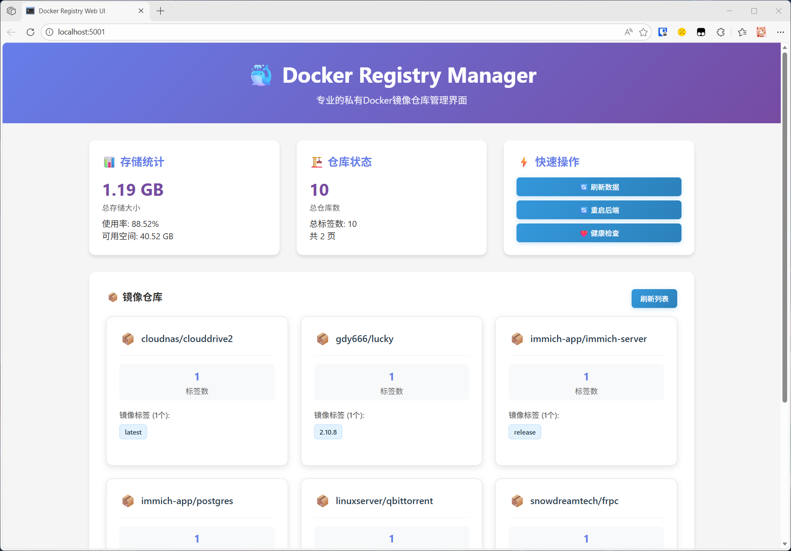
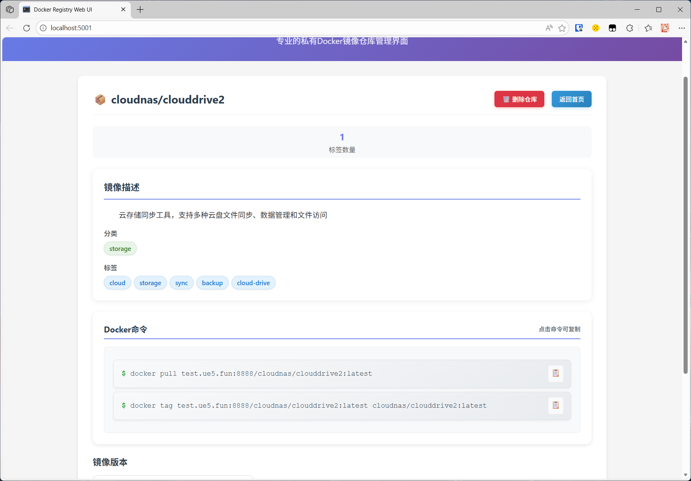
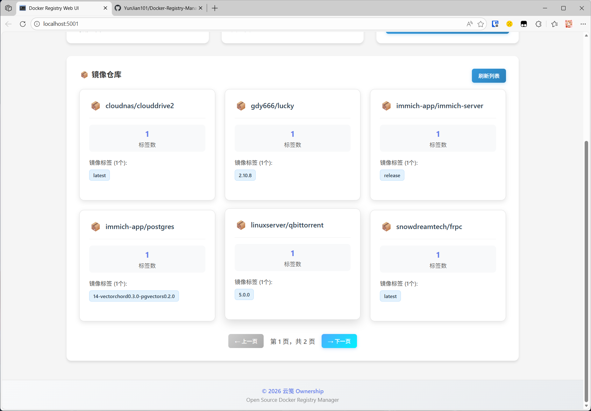
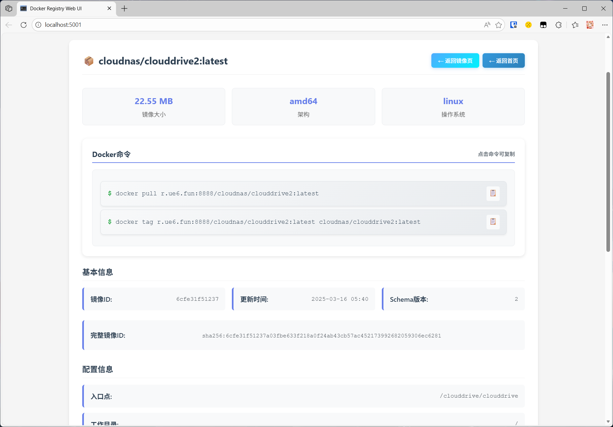

# Docker Registry Manager

## 📖 项目概述

Docker Registry Manager 是一个现代化的私有Docker镜像仓库Web管理平台，采用前后端分离架构设计。基于Python Flask后端和原生Web前端技术栈，提供直观易用的图形化界面来管理和监控Docker Registry服务。


### 🎯 核心特性
- **前后端分离架构**: 清晰的代码结构，便于维护和扩展
- **Redis缓存优化**: 高性能缓存机制，提升响应速度
- **响应式UI设计**: 完美适配各种设备屏幕
- **实时数据同步**: 自动刷新机制，确保数据准确性

## 📸 界面预览

<div align="center">
  
  
  <br><br>
  
  
</div>

## 🏗️ 系统架构

### 技术栈
- **后端**: Python 3.9 + Flask 2.3.3 + Redis缓存
- **前端**: 原生HTML5 + CSS3 + JavaScript (无框架依赖)
- **容器化**: Docker + Docker Compose
- **缓存**: Redis 4.5.4 (可选)
- **存储**: 文件系统持久化

### 项目结构
```
Docker-Registry-Manager/
├── .github/
│   └── workflows/
│       ├── docker-release.yml    # 正式版本发布
│       └── tag-monitor.yml       # 标签监控
├── backend/                      # 后端服务目录
│   ├── cache/                   # Redis缓存模块
│   ├── api.py                  # Flask API路由
│   ├── config.py               # 配置管理
│   ├── registry_api.py         # Registry API客户端
│   └── run.py                  # 应用启动入口
├── frontend/                    # 前端界面目录
│   └── index.html              # 主页面HTML
├── docker-compose.yml          # Docker编排配置
├── Dockerfile                  # 容器构建文件
├── requirements.txt            # Python依赖清单
├── CHANGELOG.md                # 版本更新日志
└── README.md                   # 项目文档
```

## 🚀 自动化发布流程

本项目采用智能化的GitHub Actions自动化发布系统，**完全零配置**：

### 📦 Docker镜像策略
正式版本发布时自动创建三个镜像标签（推送到GitHub Container Registry）：
```
ghcr.io/your-username/docker-registry-manager:v1.1.1    # 具体版本
ghcr.io/your-username/docker-registry-manager:v1.1      # 大版本  
ghcr.io/your-username/docker-registry-manager:latest    # 最新版本
```

### 🏷️ 标签分类规则
- **正式版本** (`v1.1.1`, `v2.1.5`): 自动构建镜像 + 创建Release
- **预发布版本** (`beta`, `rc1`, `dev-feature`): 仅创建标签，无构建


## 🚀 快速开始

### 环境要求
- Docker Engine 20.10+
- Docker Compose 1.29+
- 磁盘空间: 至少50GB可用空间
- 内存: 2GB RAM

### 一键部署
```bash
# 克隆项目
git clone https://github.com/YunJian101/Docker-Registry-Manager
cd Docker-Registry-Manager

# 启动服务
docker-compose up -d

# 查看服务状态
docker-compose ps
```

### 访问地址
- **Web管理界面**: http://localhost:5001

## 📦 核心功能

### 🗂️ 镜像管理
- **仓库浏览**: 直观的卡片式仓库展示
- **标签管理**: 支持标签详情查看和删除操作
- **批量操作**: 支持多标签同时管理

### 💾 存储监控
- **实时统计**: 存储使用情况实时展示
- **垃圾回收**: 自动清理未引用镜像层

### 🔧 系统运维
- **健康检查**: Registry服务状态监控
- **容器管理**: 支持Registry容器重启
- **日志查看**: 操作日志和错误追踪
- **配置管理**: 动态配置更新

## 🎨 界面特色

### 响应式设计
- 移动端友好适配
- 触摸操作优化
- 自适应布局调整

### 交互体验
- **一键复制**: Docker命令快速复制
- **实时刷新**: 数据自动同步更新
- **操作确认**: 重要操作二次确认
- **状态反馈**: 操作结果即时提示

## 🔧 配置说明

### 环境变量配置
```
# docker-compose.yml 关键配置
environment:
  - REGISTRY_BASE_URL=http://registry:5000    # Registry内部地址
  - REGISTRY_HOST=localhost:5000              # 外部访问地址，用于显示镜像仓库地址
  - REDIS_HOST=redis                         # Redis服务地址
  - REDIS_PORT=6379                          # Redis端口
```

### 存储配置
```
volumes:
  - ./data/registry:/var/lib/registry:ro     # Registry镜像数据只读挂载，用于存储空间大小判断
  - /var/run/docker.sock:/var/run/docker.sock # Docker Socket
```

## 🔌 API接口

### 镜像管理API
```
GET    /api/repositories           # 获取仓库列表
GET    /api/repository/{repo}/tags # 获取标签列表
DELETE /api/repository/{repo}/tag/{tag} # 删除镜像标签
```

### 系统管理API
```
GET    /api/storage               # 存储状态
GET    /api/health                # 健康检查
POST   /api/gc                    # 垃圾回收
POST   /api/restart-registry      # 重启Registry

### 代码结构说明
- `backend/api.py`: 主要API路由和业务逻辑
- `backend/registry_api.py`: Registry API客户端封装
- `backend/cache/redis_cache.py`: Redis缓存实现
- `backend/config.py`: 配置管理模块
- `frontend/index.html`: 前端界面和交互逻辑

## 🔒 安全建议

### 生产环境配置
1. **网络安全**:
   - 配置HTTPS证书
   - 设置防火墙规则
   - 限制访问IP范围

2. **访问控制**:
   - 启用用户认证(计划中)
   - 配置适当权限
   - 定期审计日志

3. **数据保护**:
   - 定期备份重要数据
   - 加密敏感配置
   - 监控异常访问

## 📊 性能优化

### 缓存策略
- **Redis缓存**: 减少Registry API调用频率
- **智能失效**: 基于文件修改时间的缓存更新

### 最佳实践
- 定期执行垃圾回收
- 监控存储空间使用
- 优化镜像标签管理

## 🔄 维护操作

### 日常维护
```bash
# 查看服务状态
docker-compose ps

# 查看日志
docker-compose logs -f web-ui
docker-compose logs -f registry

### 版本升级
```bash
# 拉取最新镜像
docker-compose pull

# 重启服务
docker-compose down
docker-compose up -d
```

## 🐛 故障排查

### 常见问题
1. **服务无法启动**: 检查端口占用和权限设置
2. **缓存连接失败**: 确认Redis服务状态
3. **镜像操作异常**: 验证Registry配置和权限
4. **界面显示异常**: 清除浏览器缓存

`


### 代码规范
- 遵循PEP 8 Python编码规范
- 保持前后端代码分离
- 添加必要的注释和文档
- 确保测试通过

## 📄 许可证

本项目采用GNU通用公共许可证v3.0 (GPL-3.0)，详见[LICENSE](LICENSE)文件。

## 📞 支持与反馈

- **GitHub Issues**: https://github.com/YunJian101/Docker-Registry-Manager/issues
- **项目主页**: https://github.com/YunJian101/Docker-Registry-Manager

## 🔮 未来发展计划

### 核心优化方向
- [ ] **镜像完整性校验** - 加强镜像安全性验证
- [ ] **用户认证系统** - 添加用户身份验证和权限管理
- [ ] **性能优化** - 提升系统响应速度和并发处理能力
- [ ] **异常捕获** - 完善错误处理和异常监控机制
- [ ] **AI智能描述** - 引入AI自动生成仓库介绍和标签描述

## 💝 赞助作者

如果本项目对您有帮助，欢迎通过以下方式赞助：

**支付宝 / 微信**：转账时备注"随机图API赞助"

<!-- 支付方式图片 -->
<div style="display: flex; gap: 20px;">
  
  
</div>

---

*最后更新: 2026年2月8日*  
*文档版本: v1.1.1*